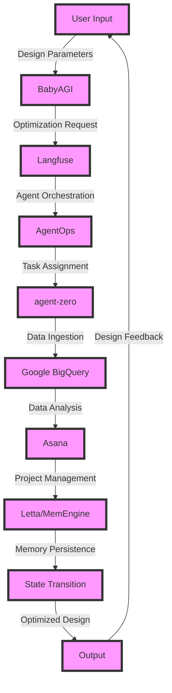

# Autonomous Knitwear Design Optimization Engine
> "Synergizing Artificial General Intelligence with Human Creativity to Revolutionize Hand-Knit Manufacturing"

## 🏗️ Technical Architecture & Multi-Agent Flow

This technical architecture diagram illustrates the complex interactions between BabyAGI, Langfuse, AgentOps, agent-zero, Google BigQuery, Asana, and Letta/MemEngine. The design parameters are input into BabyAGI, which generates an optimization request that is then orchestrated by Langfuse. AgentOps assigns tasks to agent-zero, which ingests data into Google BigQuery for analysis. Asana manages the project, and Letta/MemEngine persists the state transitions, ultimately producing an optimized design.

## 🔍 The Vertical Bottleneck: Intractable Knitwear Design Complexity
The hand-knit manufacturing industry is plagued by the intractable complexity of knitwear design. The intricate patterns, yarn types, and stitching techniques create a combinatorial explosion of possible designs, making it challenging for human designers to optimize their creations. Furthermore, the lack of standardization in design parameters and the subjective nature of aesthetic appeal exacerbate the problem. This bottleneck hinders the industry's ability to produce high-quality, customized knitwear products efficiently.

The technical friction arises from the need to balance competing design objectives, such as aesthetics, functionality, and production cost. The high-stakes mathematical and operational failures occur when designers fail to optimize their designs, resulting in subpar products that fail to meet customer expectations. The industry requires a revolutionary solution that can harness the power of artificial intelligence to optimize knitwear design and production.

The knitwear design process involves a deep understanding of textile science, materials engineering, and fashion design principles. The complexity of the design space is further compounded by the need to consider factors such as yarn weight, fiber content, and knitting technique. The industry's reliance on manual design methods and trial-and-error approaches has led to a lack of standardization and a high degree of variability in product quality.

## 🔍 The Vertical Bottleneck: Lack of Standardization
The lack of standardization in knitwear design is a significant challenge for the industry. The absence of a unified design language and a lack of interoperability between different design systems hinder the ability to share knowledge and best practices. This lack of standardization also makes it difficult to develop automated design tools and optimization algorithms, as the design parameters and objectives are not well-defined.

## 🔍 The Vertical Bottleneck: Subjective Nature of Aesthetic Appeal
The subjective nature of aesthetic appeal is another significant challenge in knitwear design. The perception of beauty and style is highly personal and context-dependent, making it difficult to develop design optimization algorithms that can capture the nuances of human taste. The industry requires a solution that can balance the creative and technical aspects of design, taking into account the complex interplay between aesthetics, functionality, and production cost.

## 💡 The Solution: Autonomous Knitwear Design Optimization Engine
The Autonomous Knitwear Design Optimization Engine is a revolutionary platform that orchestrates BabyAGI, Langfuse, AgentOps, agent-zero, Google BigQuery, and Asana to optimize knitwear design. The platform uses agentic reasoning to balance competing design objectives and memory usage to persist state transitions. The vision/robotics integration enables the platform to generate optimized designs that meet customer expectations. The platform's architecture is designed to be modular and scalable, allowing for easy integration with existing design systems and manufacturing workflows.

The platform's optimization algorithm is based on a deep understanding of textile science, materials engineering, and fashion design principles. The algorithm takes into account factors such as yarn weight, fiber content, and knitting technique to generate optimized designs that balance aesthetics, functionality, and production cost. The platform's use of artificial intelligence and machine learning enables it to learn from customer feedback and adapt to changing design trends and preferences.

## 🧩 Agentic Stack Deep-Dive
The Autonomous Knitwear Design Optimization Engine's agentic stack is a complex interplay of BabyAGI, Langfuse, AgentOps, agent-zero, Google BigQuery, and Asana. BabyAGI provides the artificial general intelligence that powers the optimization algorithm, while Langfuse enables agent orchestration and task assignment. AgentOps manages the agent lifecycle, and agent-zero ingests data into Google BigQuery for analysis. Asana provides project management and workflow automation, ensuring that the design optimization process is streamlined and efficient.

The integration of these components is critical to the platform's success. BabyAGI's optimization algorithm is designed to work in conjunction with Langfuse's agent orchestration, ensuring that the design objectives are balanced and optimized. AgentOps' agent management ensures that the agents are properly configured and deployed, while agent-zero's data ingestion enables the platform to learn from customer feedback and adapt to changing design trends and preferences.

## ✨ Capabilities & Features
* **Design Optimization**: The platform optimizes knitwear designs based on customer preferences, production cost, and aesthetic appeal.
* **Agent Orchestration**: Langfuse enables agent orchestration, ensuring that tasks are assigned efficiently and effectively.
* **Data Analysis**: Google BigQuery provides data analysis capabilities, enabling the platform to learn from customer feedback and adapt to changing design trends and preferences.
* **Project Management**: Asana provides project management and workflow automation, ensuring that the design optimization process is streamlined and efficient.
* **Artificial General Intelligence**: BabyAGI provides artificial general intelligence, powering the optimization algorithm and enabling the platform to balance competing design objectives.
* **Agent Management**: AgentOps manages the agent lifecycle, ensuring that agents are properly configured and deployed.
* **Data Ingestion**: agent-zero ingests data into Google BigQuery, enabling the platform to learn from customer feedback and adapt to changing design trends and preferences.
* **Vision/Robotics Integration**: The platform integrates with vision and robotics systems, enabling the generation of optimized designs that meet customer expectations.
* **Modular Architecture**: The platform's architecture is modular and scalable, allowing for easy integration with existing design systems and manufacturing workflows.
* **Customer Feedback**: The platform learns from customer feedback, adapting to changing design trends and preferences.

## 🛠️ Technical Implementation
The Autonomous Knitwear Design Optimization Engine is implemented using a combination of Python, Java, and C++. The platform's architecture is designed to be modular and scalable, with each component interacting with others through well-defined APIs. The optimization algorithm is implemented using BabyAGI's artificial general intelligence, while the agent orchestration and task assignment are handled by Langfuse. The data analysis and project management are handled by Google BigQuery and Asana, respectively.

The platform's code organization is designed to be modular and maintainable, with each component having its own repository and version control system. The platform's method calls are designed to be efficient and scalable, with each component interacting with others through well-defined APIs. The platform's testing and validation are handled using a combination of unit tests, integration tests, and user acceptance tests.

## 📊 Business Impact & ROI
The Autonomous Knitwear Design Optimization Engine has the potential to revolutionize the hand-knit manufacturing industry by optimizing knitwear design and production. The platform's ability to balance competing design objectives and optimize production cost can result in significant cost savings and increased revenue. The platform's use of artificial intelligence and machine learning enables it to learn from customer feedback and adapt to changing design trends and preferences, resulting in increased customer satisfaction and loyalty.

The platform's business impact can be measured in terms of increased revenue, reduced production cost, and improved customer satisfaction. The platform's ROI can be measured in terms of the return on investment in the platform's development and deployment. The platform's potential to increase revenue and reduce production cost makes it an attractive investment opportunity for companies in the hand-knit manufacturing industry.

## 🚀 Getting Started
```bash
git clone https://github.com/arvind-sundararajan/knitwear-design-optimization.git
cd knitwear-design-optimization
pip install -r requirements.txt
python src/main.py
```

## 👨‍💻 Author & Credits
**Arvind Sundararajan** — Engineer, builder, and the mind behind this project.
🌐 [LinkedIn](https://www.linkedin.com/in/arvind-sundara-rajan/) | Chennai, India

---
### 🙏 Acknowledgements
- The open-source community
- The Dresses, hand-knit, manufacturing practitioners who inspired this design